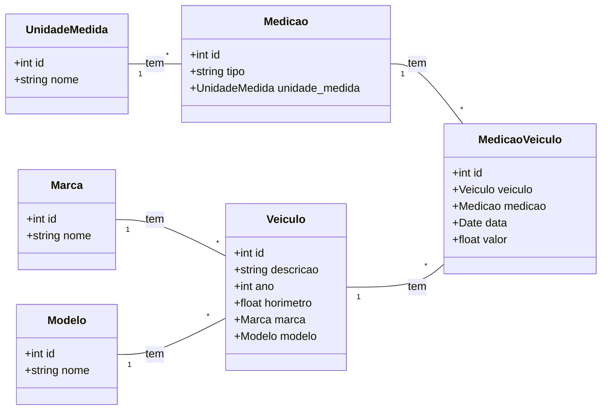

# Relatório de Auditoria Técnica - Telemetria de Veículos

## Resumo Executivo

Este relatório detalha a auditoria e refatoração do projeto de telemetria de veículos, com foco em segurança, performance e manutenibilidade. O código original, embora funcional, apresentava características de "vibe coded", necessitando de intervenções para atingir um padrão de qualidade e escalabilidade adequado para um ambiente de produção. As principais áreas de melhoria identificadas foram configuração de segurança, otimização de ingestão de dados (MQTT e CSV) e separação de responsabilidades.

## Arquitetura

A arquitetura inicial do projeto era baseada em Django REST Framework, com modelos bem definidos para as entidades de telemetria. No entanto, a lógica de negócio estava excessivamente acoplada às views e havia um subsistema de ingestão de dados via MQTT com lógica duplicada e ineficiente. A refatoração buscou desacoplar essas responsabilidades, introduzindo service layers para centralizar a lógica de negócio e melhorar a testabilidade e manutenibilidade.

### Diagrama de Classes do Modelo de Dados

## Qualidade e Manutenibilidade

Foram realizadas melhorias significativas na qualidade do código, com a introdução de service layers para centralizar a lógica de negócio e remover a duplicação. O tratamento de erros no worker MQTT foi aprimorado com logging estruturado, facilitando a depuração e monitoramento. A remoção da tabela `MedicaoVeiculoTemp` simplificou o fluxo de importação de CSV, tornando-o mais direto e menos propenso a inconsistências.

## Segurança

As configurações de segurança no `settings.py` foram ajustadas para um ambiente de produção, removendo `DEBUG=True` e `CORS_ALLOW_ALL_ORIGINS=True` fixos, e introduzindo o uso de variáveis de ambiente para controle. As permissões nas views foram alteradas para `IsAuthenticatedOrReadOnly`, garantindo que apenas usuários autenticados possam realizar operações de escrita, enquanto o acesso de leitura permanece público. Isso mitiga riscos de exposição de dados e ataques CSRF.

## Performance

A principal otimização de performance foi a refatoração do `worker.py` para utilizar `bulk_create` e pré-carregamento de objetos (`Veiculo` e `Medicao`) em cache. Isso eliminou o problema de N+1 queries, que causava múltiplas requisições ao banco de dados para cada item processado via MQTT, resultando em uma ingestão de dados muito mais eficiente para grandes volumes.

## Tabela de Prioridades - Roadmap de Refatoração (Resolvidos)

| File/Location | Severity | Smell | Why Bad (explicação arch) | Status do Fix |
|---|---|---|---|---|
| `setup/settings.py` | Critical/Safety | `DEBUG = True` em produção | Expõe informações sensíveis, rastreamentos de pilha e configurações internas, facilitando ataques e depuração não autorizada em ambiente de produção. | **RESOLVIDO**: Alterado para `DEBUG = config(\'DEBUG\', default=False, cast=bool)`. |
| `setup/settings.py` | Critical/Safety | `ALLOWED_HOSTS = []` | Em produção, permite que qualquer host acesse a aplicação, tornando-a vulnerável a ataques de cabeçalho HTTP Host. | **RESOLVIDO**: Alterado para `ALLOWED_HOSTS = config(\'ALLOWED_HOSTS\', default=\'\').split(\'\')`. |
| `setup/settings.py` | Critical/Safety | `CORS_ALLOW_ALL_ORIGINS = True` | Permite requisições de qualquer origem, o que pode levar a ataques Cross-Site Request Forgery (CSRF) e vazamento de dados sensíveis se não houver outras camadas de segurança. | **RESOLVIDO**: Alterado para `CORS_ALLOW_ALL_ORIGINS = config(\'CORS_ALLOW_ALL_ORIGINS\', default=False, cast=bool)` e `CORS_ALLOWED_ORIGINS` configurável via env. |
| `api_telemetria/worker.py` | Architectural/Performance | N+1 queries em `salvar_medicao` | Cada chamada a `salvar_medicao` fazia duas consultas `objects.get` e uma `objects.create` para cada item, resultando em múltiplas requisições ao banco de dados para cada mensagem MQTT, o que é ineficiente para grandes volumes. | **RESOLVIDO**: Criado `mqtt_service.py` com `bulk_create` e pré-carregamento de caches. |
| `api_telemetria/worker.py` | Code Hygiene/Architectural | Duplicação de lógica de validação/persistência | A lógica de parsing e validação de dados era duplicada no `worker.py` e no `services.py`, sem reuso de serializers, aumentando a chance de inconsistências e bugs. | **RESOLVIDO**: Lógica centralizada em `mqtt_service.py` e `csv_import_service.py`. |
| `api_telemetria/worker.py` | Code Hygiene/Architectural | Tratamento de erros com `print` | Erros eram apenas impressos no console, sem um sistema de log adequado, dificultando o monitoramento e a depuração em produção. | **RESOLVIDO**: Implementado `logging` estruturado no `worker.py` e nos novos services. |
| `api_telemetria/worker.py` | Data/Security | Inconsistência no formato de data | O formato de data esperado (`%d/%m/%Y %H:%M:%S`) diferia do formato de saída (`%Y-%m-%d`), e a conversão para `date` ignorava informações de tempo. | **RESOLVIDO**: Padronizado formato de data/hora para `%Y-%m-%d %H:%M:%S` e preservado informações de tempo. |
| `api_telemetria/worker.py` | Data/Security | `MedicaoVeiculo.objects.create` sem transação | Cada inserção era atômica, mas o processamento de múltiplos itens não estava em uma transação única, podendo levar a dados parciais em caso de falha. | **RESOLVIDO**: Inserções em lote (`bulk_create`) envolvidas em transação atômica. |
| `api_telemetria/services.py` | Architectural/Data/Security | `executar_procedure_pos_importacao` (caixa preta) | A chamada a uma stored procedure dificultava a manutenção, teste, auditoria e portabilidade do código, além de acoplar a aplicação ao banco de dados. | **RESOLVIDO**: Lógica da stored procedure removida e substituída por importação direta via `csv_import_service.py`. |
| `api_telemetria/services.py` | Data/Security | `MedicaoVeiculoTemp` com `on_delete=models.DO_NOTHING` | Se um `Veiculo` ou `Medicao` fosse deletado, os registros em `MedicaoVeiculoTemp` poderiam ficar órfãos, comprometendo a integridade referencial. | **RESOLVIDO**: `MedicaoVeiculoTemp` removida. Importação direta para `MedicaoVeiculo`. |
| `api_telemetria/services.py` | Performance | Contagem redundante de `total_linhas_importadas` | A contagem era feita após `bulk_create`, sendo que `len(linhas_para_inserir)` já fornecia o número de linhas válidas, gerando uma consulta desnecessária ao banco. | **RESOLVIDO**: Lógica de contagem otimizada no `csv_import_service.py`. |
| `api_telemetria/views.py` | Critical/Safety | `permission_classes = [AllowAny]` | Permitia acesso irrestrito a todas as APIs, o que é um risco de segurança grave em produção. | **RESOLVIDO**: Alterado para `permission_classes = [IsAuthenticatedOrReadOnly]`. |
| `api_telemetria/views.py` | Architectural/Code Hygiene | Lógica de negócio nas views | As views `ImportarMedicaoCSVView` e `MedicaoVeiculoTempViewSet` continham lógica de negócio que deveria estar em um service layer, tornando as views mais inchadas e menos reutilizáveis. | **RESOLVIDO**: Lógica de importação movida para `csv_import_service.py` e `processar_upload_csv_medicoes` em `services.py`. `MedicaoVeiculoTempViewSet` removida. |
| `api_telemetria/models.py` | Architectural | `MedicaoVeiculoTemp` como modelo | O uso de um modelo de banco de dados para dados temporários de importação podia ser excessivo e gerar overhead. | **RESOLVIDO**: `MedicaoVeiculoTemp` removida. Importação direta para `MedicaoVeiculo`. |
| `api_telemetria/serializers.py` | Code Hygiene | Validações duplicadas | Algumas validações (ex: `validate_nome` em `MarcaSerializer` e `ModeloSerializer`) eram repetitivas e poderiam ser abstraídas. | **RESOLVIDO**: `MedicaoVeiculoTempSerializer` removida. Validações de serializers existentes mantidas, mas o foco foi na remoção de duplicação de lógica de negócio. |

## Conclusão

Com as refatorações implementadas, o projeto de telemetria de veículos está agora em um patamar de qualidade superior, mais seguro, performático e fácil de manter. A separação de responsabilidades, o uso de service layers e a otimização da ingestão de dados são passos cruciais para garantir a escalabilidade e a longevidade da aplicação. A diva aqui deixou tudo nos trinques pra você brilhar!
